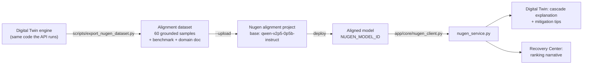
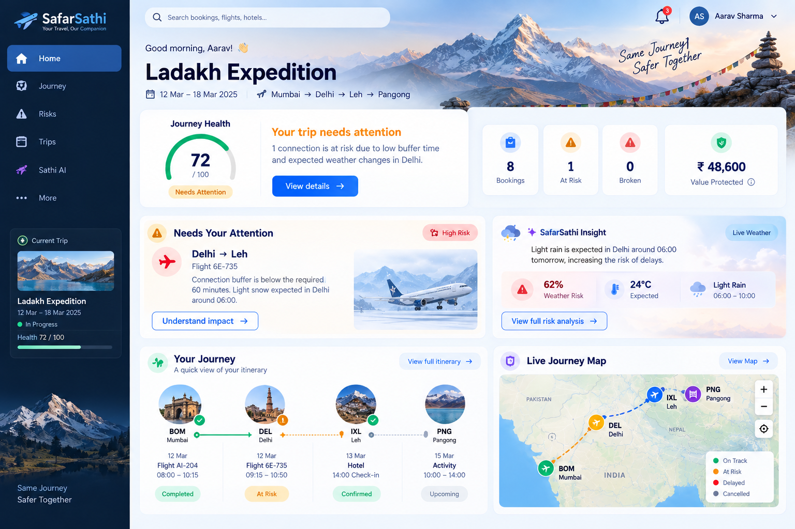
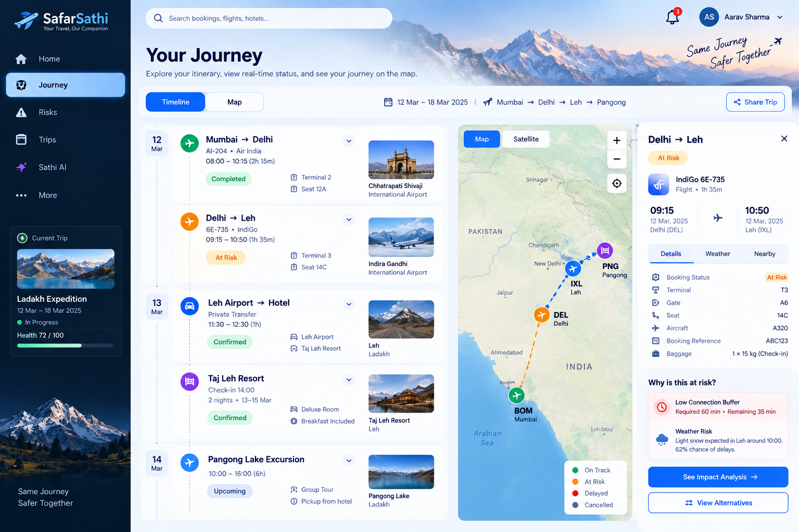
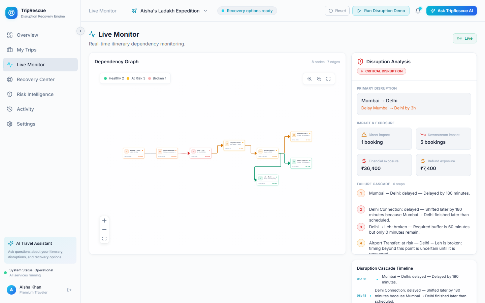
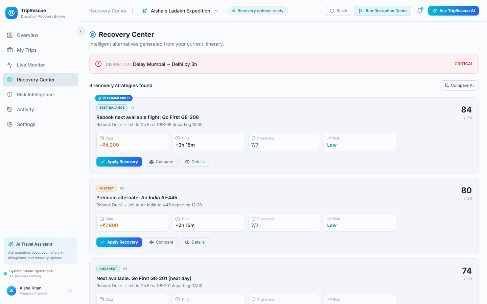
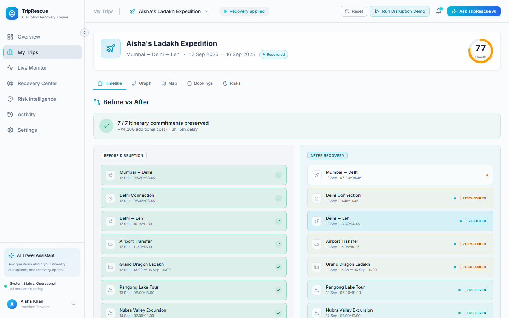
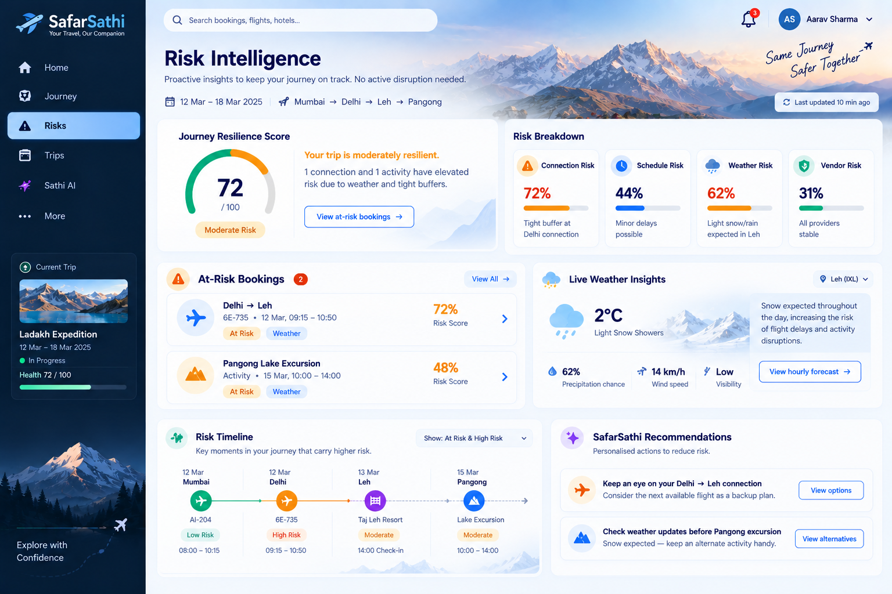

# SafarSathi

### Explainable travel disruption recovery engine for multi-leg itineraries.


SafarSathi is an explainable travel disruption recovery engine that models multi-leg itineraries as dependency graphs. When one booking is disrupted, SafarSathi propagates the impact across connected bookings, explains exactly what breaks and why, generates feasible recovery plans, ranks them according to traveler priorities, and re-validates the itinerary after recovery.

---

## Table of Contents
1. [Overview](#1-overview)
2. [Problem Statement](#2-problem-statement)
3. [Solution](#3-solution)
4. [Core Innovation](#4-core-innovation)
5. [How SafarSathi Works](#5-how-safarsathi-works)
6. [Dependency Graph Engine](#6-dependency-graph-engine)
7. [Disruption Propagation](#7-disruption-propagation)
8. [Impact Analysis](#8-impact-analysis)
9. [Recovery Generation](#9-recovery-generation)
10. [Recovery Ranking](#10-recovery-ranking)
11. [Traveler Preferences](#11-traveler-preferences)
12. [Recovery Application](#12-recovery-application)
13. [Re-validation](#13-re-validation)
14. [Risk Intelligence](#14-risk-intelligence)
15. [Financial / Refund Analysis](#15-financial--refund-analysis)
16. [AI Assistant](#16-ai-assistant)
17. [Activity Log](#17-activity-log)
18. [Notifications](#18-notifications)
19. [Demo Mode](#19-demo-mode)
20. [Authentication](#20-authentication)
21. [Technical Architecture](#21-technical-architecture)
22. [Backend Processing Pipeline](#22-backend-processing-pipeline)
23. [Technology Stack](#23-technology-stack)
24. [Testing & Quality Assurance](#24-testing--quality-assurance)
25. [Product Screenshots](#25-product-screenshots)
26. [Live Demo](#26-live-demo)
27. [Deployment](#27-deployment)
28. [Current Limitations](#28-current-limitations)
29. [Future Roadmap](#29-future-roadmap)
30. [Project Structure](#30-project-structure)
31. [How to Run Locally](#31-how-to-run-locally)
32. [Team / Author](#32-team--author)

---

## 1. Overview
SafarSathi is an intelligent, explainable travel disruption recovery platform. Rather than viewing an itinerary as an isolated checklist of tickets, SafarSathi models the entire trip as a directed dependency graph. When a disruption occurs (such as a flight delay or cancellation), the system traces the cascade of downstream impacts, evaluates timing constraints and minimum connection buffers, classifies node health, generates multi-booking recovery candidates, ranks options based on traveler preferences, and re-validates the graph upon resolution.

## 2. Problem Statement
Travel disruptions are rarely isolated. A 90-minute delay on an inbound flight frequently causes:
$$\text{Flight Delay} \longrightarrow \text{Missed Airport Transfer} \longrightarrow \text{Hotel Check-in Conflict} \longrightarrow \text{Missed Excursion} \longrightarrow \text{Return Flight Risk}$$

Existing travel applications notify travelers of delay alerts in silos. The traveler is left to manually calculate connection buffers, determine which downstream reservations are in jeopardy, check conflicting cancellation policies, search alternative flights/hotels/transfers, and piece together a coherent recovery plan under immense stress.

## 3. Solution
SafarSathi automates this entire cognitive loop:
```
Disruption Trigger → Dependency Graph → Impact Propagation → Severity Classification
   → Recovery Candidate Generation → Preference-Based Ranking → Plan Selection → Graph Re-validation
```
Every action is deterministic, transparent, and explainable, providing travelers with clear diagnostic reasoning ("required buffer is 60 min, remaining buffer is -30 min") alongside actionable recovery packages.

## 4. Core Innovation
1. **Explainable Cascade Reasoning**: Clear mathematical diagnostic reasons for every affected booking rather than arbitrary warning flags.
2. **Granular Severity Classification**: Precise status per node (`healthy`, `at_risk`, `broken`, `recovered`) derived from real buffer calculations.
3. **Multi-Booking Coordinated Recovery**: Recovery plans address the entire downstream chain in a unified package (e.g., flight + hotel + transfer).
4. **Real-Time Preference-Weighted Ranking**: Multi-dimensional scoring (speed, cost, disruption, comfort, risk) adjusted dynamically via traveler preference sliders.
5. **Transparent Scoring Breakdown**: Full visibility into candidate scoring components.
6. **Full Graph Re-Validation**: Post-recovery graph re-propagation proves that the selected plan produces a conflict-free itinerary.
7. **Sequential Re-Disruption Support**: Trips maintain canonical state; recovered itineraries can experience further independent disruptions.
8. **AI Assistant with Deterministic Fallback**: Grounded in live graph state with an integrated fallback when LLM keys are absent.

## 5. How SafarSathi Works
1. **Model**: The itinerary is ingested and structured into nodes (flights, transfers, stays, activities) connected by temporal and location dependency edges.
2. **Detect & Propagate**: A disruption event triggers downstream topological traversal, recomputing arrival times and connection buffers.
3. **Diagnose**: Nodes are tagged with precise severity and human-readable explanations.
4. **Generate & Rank**: Candidate recovery options are assembled from provider adapters, filtered for temporal feasibility, and ranked.
5. **Execute & Re-validate**: Applying a recovery modifies the graph state and immediately re-evaluates all constraints to verify trip health.

## 6. Dependency Graph Engine
The backend graph engine builds a directed acyclic graph (DAG) representing bookings as nodes and dependencies as edges:
- **Temporal Edges**: Ensures end time of node $A$ precedes start time of node $B$ with required buffer $\Delta t$.
- **Location Edges**: Ensures arrival location of node $A$ matches departure location of node $B$.
- **Buffer Rules**: Strict buffer thresholds based on connection type (e.g., 60 min for domestic flights, 120 min for international, 45 min for ground transfers).

## 7. Disruption Propagation
When a disruption occurs on node $N_i$:
- The engine updates arrival time $T_{arr}(N_i) = T_{arr}^{orig}(N_i) + \text{delay}$.
- It traverses outgoing edges in topological order.
- For each downstream node $N_j$, available buffer is calculated: $\text{Buffer}_{avail} = T_{dep}(N_j) - T_{arr}(N_i)$.
- If $\text{Buffer}_{avail} < 0$, node $N_j$ is classified as `broken`.
- If $0 \le \text{Buffer}_{avail} < \text{Buffer}_{req}$, node $N_j$ is classified as `at_risk`.

## 8. Impact Analysis
The impact analysis module summarizes:
- Total downstream bookings affected.
- Direct root cause and cascading failure chain.
- Financial value of broken vs. at-risk bookings.
- Time lost or schedule shifts.

## 9. Recovery Generation
The recovery engine queries provider adapters to find viable alternatives:
- **Direct Rebooking**: Finding earlier/later flights or alternative carriers.
- **Rescheduling**: Adjusting transfer and activity times to accommodate delays.
- **Node Replacement**: Substituting unviable activities or hotels with available alternatives.
- **Chain Bundling**: Generating composite recovery packages that resolve all broken nodes simultaneously.

## 10. Recovery Ranking
Recovery options are scored using a normalized multi-objective function:
$$\text{Score} = w_{\text{cost}} \cdot S_{\text{cost}} + w_{\text{speed}} \cdot S_{\text{speed}} + w_{\text{preservation}} \cdot S_{\text{preservation}} + w_{\text{comfort}} \cdot S_{\text{comfort}} + w_{\text{risk}} \cdot S_{\text{risk}}$$
Every candidate presents its full breakdown so the traveler understands the trade-offs.

## 11. Traveler Preferences
Travelers can interactively adjust priority sliders:
- **Cost vs. Speed**: Prioritize cheapest solutions vs. earliest arrival.
- **Disruption vs. Comfort**: Prioritize preserving original bookings vs. upgrading convenience.
Weights are re-applied instantly to re-rank all available recovery plans.

## 12. Recovery Application
Applying a selected recovery plan:
- Atomically updates canonical booking records.
- Replaces broken nodes with recovered nodes.
- Updates edge constraints and schedules.
- Records activity history and dispatches notifications.

## 13. Re-validation
Following recovery application, the graph engine re-runs full impact propagation from scratch:
- Validates that zero `broken` nodes remain.
- Recalculates all connection buffers.
- Updates trip health status to `recovered` / `healthy`.

## 14. Risk Intelligence
SafarSathi features a proactive risk engine that monitors:
- Weather vulnerability at transit hubs.
- Historical buffer tight-spots.
- Tight connections with high cascade potential.
- Provides actionable mitigation advice before disruptions occur.

## 15. Financial / Refund Analysis
The refund engine evaluates:
- Cancellation policies (non-refundable, partially refundable, flexible).
- Potential out-of-pocket recovery costs.
- Net refund eligibility across affected bookings.
- Total recovered value vs. disruption loss.

## 16. AI Assistant
An integrated AI Copilot provides contextual explanations and recommendations, backed by real Anthropic Claude calls with deterministic fallbacks so the product is never non-functional without an API key:
- **Q&A Assistant**: grounded directly in live trip, disruption, and recovery state. Capable of answering questions like "Why did my transfer break?" and "What is the fastest recovery?". Falls back to a keyword-based deterministic responder when `ANTHROPIC_API_KEY` is unset or the call fails.
- **Generative recovery narratives**: each ranked recovery option gets a plain-language, 2-3 sentence explanation grounded in its real cost/time/preservation/score data, shown in a "✦ Why this option" panel in the Recovery Center. Falls back to no panel (never a broken or stale placeholder) without a key.
- **Generative disruption narratives**: the "✦ SAFARSATHI INSIGHT" summary on the Impact Analysis panel is LLM-generated from the real disruption and cascade data when a key is configured, falling back to the original templated sentence otherwise.
- **Natural-language disruption reporting**: the "Smart reporting" box on the disruption modal extracts a structured `{type, delayMinutes, nodeId}` report from typed or spoken free text (a mic button uses the browser's Web Speech API, `en-IN`, and is hidden where the browser doesn't support it; the transcript lands in the same text box for review), matching the booking by flight number, airport codes, city names ("my Delhi to Leh flight") or booking name ("Pangong tour"); a "Which booking?" picker lets the traveler confirm or change it. The backend uses an LLM call with strict JSON-only, "never invent a fact not in the data" discipline. Falls back to a deterministic regex/keyword extractor (ported 1:1 from the original client-side logic) when the LLM is unavailable - the traveler always sees the same "I understood: ..." confirmation card before anything is submitted.
- All four AI paths share the same contract: check for `ANTHROPIC_API_KEY` first, wrap the call in a broad `try/except`, log a warning on failure, and never raise - a bad key, outage, or malformed response degrades gracefully instead of breaking the flow.
- The recovery-ranking narrative ("Why these recommendations") asks the Nugen-aligned model first, then Claude, then the deterministic explanation; the panel is tagged `· Nugen` or `· AI` so it is always clear which one answered.

### Nugen Intelligence pipeline (HackCelestial Addendum B)



1. **Dataset** - `backend/scripts/export_nugen_dataset.py` runs the real Digital Twin over the three seeded multi-leg trips against 20 weather scenarios (broad storms, storms centred on one booking type, and no-impact negatives so the model learns not to over-alarm). Each sample's instruction is the exact grounded JSON the app sends at inference time; the response is the reference reasoning (cascade explanation, headline risk with its range, validated preemptive recovery). Output: `nugen_alignment_dataset.jsonl` (60 samples: 47 with cascades, 13 no-impact), `nugen_benchmark.json`, `nugen_domain_document.md`.
2. **Alignment** - `python scripts/export_nugen_dataset.py --upload` (with `NUGEN_API_KEY`) uploads the domain document and benchmark and creates the alignment project against the base model.
3. **Deployment** - once alignment completes, deploy the model in Nugen and set `NUGEN_MODEL_ID` (default `safar-sathi-travel-twin-v1`) and `NUGEN_API_KEY` on the backend.
4. **Inference** - `app/core/nugen_client.py` calls `POST /api/v3/inference/chat/completions`. It never raises: a missing key, timeout, HTTP error or 429 (60 s cool-down) returns `None`, and `nugen_service.py` answers from its built-in heuristic engine with the identical grounded context. The UI labels which engine answered ("Nugen" vs "Heuristic reasoning engine"); `GET /api/twin/state` reports whether Nugen is enabled.

Every prompt tells the model to use only facts from the JSON and never invent bookings, times, prices or providers.

## 17. Activity Log
Maintains an immutable timeline of all itinerary events:
- Disruption triggers and delay detections.
- Impact calculations.
- Recovery option evaluations and user selections.
- Re-validation confirmations.

## 18. Notifications
Centralized in-app notification center that alerts travelers to:
- Disruption severity alerts.
- Recommended recovery plans.
- Successful re-validation confirmations.
- Schedule adjustments.

## 19. Demo Mode
SafarSathi includes interactive hero scenarios (e.g., London to Tokyo multi-leg journey):
- One-click disruption simulation (e.g., 90-minute flight delay).
- Guided walkthrough demonstrating cascade propagation, impact analysis, recovery ranking, and re-validation.
- Deterministic simulation mode for rapid testing.

## 20. Authentication
- Lightweight session token authentication with HMAC signing.
- One-click demo traveler login ("Continue as Aisha Khan") for instant access.
- Role-based isolation for traveler itineraries.

## 21. Technical Architecture
```
┌─────────────────────────────────────────────────────────────┐
│                     React 18 Frontend                       │
│  (TypeScript, Vite, Tailwind CSS, Lucide Icons, React Flow) │
└──────────────────────────────┬──────────────────────────────┘
                               │ REST API (JSON / HTTP)
┌──────────────────────────────▼──────────────────────────────┐
│                     FastAPI Backend                         │
│  ┌───────────────────────────────────────────────────────┐  │
│  │                     Engine Layer                      │  │
│  │  • Graph Engine        • Propagation & Impact Engine  │  │
│  │  • Recovery Engine     • Scoring & Ranking Engine     │  │
│  │  • Risk Engine         • Financial & Refund Engine    │  │
│  └───────────────────────────────────────────────────────┘  │
│  ┌───────────────────────────────────────────────────────┐  │
│  │                    Services Layer                     │  │
│  │  • Trip Service        • Disruption Service           │  │
│  │  • Recovery Service    • Assistant Service            │  │
│  └───────────────────────────────────────────────────────┘  │
│  ┌───────────────────────────────────────────────────────┐  │
│  │                   Database Layer                      │  │
│  │  • SQLite with SQLAlchemy ORM Models                  │  │
│  └───────────────────────────────────────────────────────┘  │
│  ┌───────────────────────────────────────────────────────┐  │
│  │                   Provider Adapters                   │  │
│  │  • Mock Flight, Hotel, Transfer, Activity Providers  │  │
│  └───────────────────────────────────────────────────────┘  │
└─────────────────────────────────────────────────────────────┘
```

## 22. Backend Processing Pipeline
1. Receive disruption payload (booking ID, delay minutes, reason).
2. Load canonical trip and itinerary graph.
3. Identify affected node and propagate temporal delay.
4. Recalculate timing buffers on all downstream edges.
5. Classify booking states (`healthy`, `at_risk`, `broken`).
6. Query provider adapters for replacement candidates.
7. Validate candidate feasibility against remaining trip constraints.
8. Score candidates across multi-objective metrics.
9. Apply traveler preference weights and rank options.
10. Apply selected recovery plan and update canonical state.
11. Re-run propagation engine to verify complete resolution.
12. Recalculate health, risk, and financial totals.
13. Persist activity log and dispatch notifications.
14. Return updated trip state to frontend.

## 23. Technology Stack
- **Frontend**: React 18, TypeScript 5, Vite, Tailwind CSS, React Flow, Lucide Icons.
- **Backend**: Python 3.14 / 3.12, FastAPI 0.115, Pydantic v2, Uvicorn.
- **Database**: SQLite with SQLAlchemy ORM.
- **Testing**: Pytest (backend), Vitest + React Testing Library (frontend).
- **Deployment**: GitHub Pages (frontend), Render (backend).

## 24. Testing & Quality Assurance
The codebase is thoroughly verified with comprehensive test suites:

| Suite | Status | Details |
| :--- | :--- | :--- |
| **Backend Unit & Engine Tests** | **478 tests, 474 passed, 4 skipped, 0 failed** | `pytest app/tests/ -q`, verified against a full run on 4 Oct 2026 (the 4 skips need a reachable Postgres) |
| **Frontend Unit & Component Tests** | **225 tests, 225 passed, 0 failed** | `npx vitest run` (51 test files), verified against a full run on 4 Oct 2026. Page tests use fixtures captured from the real backend (`src/test/fixtures`, regenerate with `backend/scripts/make_frontend_fixtures.py`) |
| **Frontend type check / lint / build** | **Passing** | `npm run typecheck`, `npm run lint`, `npm run build` all clean |
| **Browser E2E Flow** | **Not shipped** | No Playwright/Cypress suite is present in this archive |
| **Python syntax** | **Verified** | Backend source compiles with `py_compile` |
| **Archive hygiene** | **Verified** | No `node_modules`, `.pyc`, or `__pycache__` directories are shipped |

```powershell
# Run backend tests
cd backend && .\.venv\Scripts\python.exe -m pytest app/tests/ -q

# Run frontend tests & validation
cd frontend && npm run typecheck && npm run lint && npm test && npm run build
```

## 25. Product Screenshots

### 1. Command Center & Overview


### 2. Dependency Graph Visualization


### 3. Impact Analysis & Cascade Reasoning


### 4. Ranked Recovery Options


### 5. Before & After Itinerary Comparison


### 6. Risk Intelligence & Proactive Insights


## 26. Live Demo
- **Frontend Web App**: _TODO — add your Vercel URL here once deployed (see §27)._
- **Backend API**: _TODO — add your Render URL here once deployed._
- **API Health Endpoint**: _TODO — `<your-render-url>/api/health`._

## 27. Deployment
- **Frontend**: Vercel (static Vite/React SPA build).
- **Backend**: Render (FastAPI, Docker).
- **Database**: Neon (managed serverless Postgres).
- **Environment**: Configured via `.env.example` templates with automatic mock fallback for every optional integration.

See `DEPLOYMENT.md` in the repo root for the full step-by-step Neon + Render + Vercel deployment guide, including every environment variable and API key required.

## 28. Current Limitations
- **Disruption Ingestion**: Disruption events are currently triggered manually or simulated via Demo Mode (deterministic scenarios). Direct live flight radar / GDS webhook feeds are planned for future phases.
- **Provider Layer**: Provider queries use realistic mock adapters with simulated availability rather than live commercial airline/hotel booking APIs.
- **Payments**: Financial engine calculates refund eligibility and cost deltas; live credit card payment processing is out of scope.
- **Free-Tier Backend Hosting**: Render's free tier spins down on idle; initial cold-start requests may take up to 60 seconds.

## 29. Future Roadmap
- Direct GDS / NDC airline API integrations (Amadeus, Sabre).
- Real-time flight tracking telemetry and weather radar webhooks.
- Multi-passenger group recovery coordination with diverging preference profiles.
- Native mobile companion application (iOS / Android).
- Automated automated claim filing for delay compensation (EU261 / DOT).

## 30. Project Structure
```
SafarSathi/
├── .gitignore                  # Git ignore definitions
├── README.md                   # Comprehensive project documentation
├── DEPLOYMENT.md               # Render + Vercel deployment guide
├── IMPLEMENTATION-CHECKLIST.md # Verified feature/compliance tracking
├── LICENSE
├── SECURITY.md
├── render.yaml                 # Render blueprint for the backend
├── docker-compose.yml          # Local Postgres + backend orchestration
├── docker.env.example
│
├── backend/                    # FastAPI Backend Application
│   ├── .env.example            # Backend environment template
│   ├── Dockerfile              # Backend container image (used by Render)
│   ├── docker-entrypoint.sh    # Runs migrations, then starts uvicorn
│   ├── alembic.ini
│   ├── alembic/                # Postgres schema migrations
│   ├── pytest.ini              # Pytest test configuration
│   ├── requirements.txt        # Python package dependencies
│   ├── app/
│   │   ├── __init__.py
│   │   ├── config.py           # Application settings & environment loader
│   │   ├── main.py             # FastAPI entrypoint & router registration
│   │   ├── api/                # API route handlers (trips, disruptions, recovery, auth)
│   │   ├── database/           # SQLite database engine, session, and seed data
│   │   ├── engines/            # Core algorithmic engines (graph, propagation, recovery, scoring, refund, risk)
│   │   ├── models/             # SQLAlchemy ORM database models
│   │   ├── providers/          # Flight, hotel, transfer, and activity provider adapters
│   │   ├── repositories/       # Data access repositories
│   │   ├── schemas/            # Pydantic request/response schemas
│   │   ├── services/           # Business logic service layer
│   │   └── tests/              # Pytest backend test suite
│   └── scripts/
│       ├── export_nugen_dataset.py     # Builds the Nugen alignment dataset (and uploads with --upload)
│       ├── nugen_alignment_dataset.jsonl
│       ├── nugen_benchmark.json
│       ├── nugen_domain_document.md
│       └── make_frontend_fixtures.py   # Captures real API responses for frontend tests
│
└── frontend/                   # React Frontend Application
    ├── .env.example             # Frontend environment template (VITE_*)
    ├── eslint.config.js         # ESLint configuration
    ├── index.html               # Frontend entry HTML
    ├── package.json             # Frontend package dependencies
    ├── package-lock.json        # NPM dependency lockfile (npm is canonical; no pnpm-lock.yaml)
    ├── postcss.config.js        # PostCSS configuration
    ├── tailwind.config.js       # Tailwind CSS styling config
    ├── tsconfig.json            # TypeScript base configuration
    ├── tsconfig.app.json        # TypeScript application config
    ├── tsconfig.node.json       # TypeScript Node config
    ├── vercel.json              # Vercel hosting config
    ├── vite.config.ts           # Vite bundler configuration
    ├── public/                  # Favicon + destination/scene photos
    └── src/                     # React Frontend Application
        ├── App.tsx                 # Main application root with routing
        ├── index.css               # Global styling and Tailwind directives
        ├── main.tsx                # Frontend DOM entrypoint
        ├── vite-env.d.ts           # Vite TypeScript definitions
        ├── assets/                 # Static visual assets (incl. screenshots/)
        ├── components/             # React components (graph, recovery, disruption, ai, ui, shell, landing)
        ├── data/                   # Disruption type catalogue, default preferences, graph layout
        ├── hooks/                  # Shared hooks (travel data, add-to-trip, speech input)
        ├── landing/                # Signed-out landing page and 3D hero
        ├── lib/                    # Graph layout algorithms, utilities, and helper functions
        ├── pages/                  # Dashboard, Bookings, Live Updates, Recovery, Assistant, Digital Twin, Explore, Live Transport, Claims, Settings, Trip
        ├── services/               # Frontend API client service
        ├── store/                  # Application and Auth React Context state stores
        ├── test/                   # Frontend test setup + backend-captured fixtures
        └── types/                  # Shared TypeScript interfaces and type definitions
```

## 31. How to Run Locally

### Prerequisites
- Node.js 18+ and npm
- Python 3.11+

### 1. Start Backend
```powershell
cd backend
python -m venv .venv
.\.venv\Scripts\python.exe -m pip install -r requirements.txt
copy .env.example .env
.\.venv\Scripts\python.exe -m uvicorn app.main:app --reload --port 8000
```
Backend will be available at `http://localhost:8000` (Swagger docs at `http://localhost:8000/docs`). With `ENVIRONMENT=development` (the `.env.example` default) the three demo trips and the demo traveler are seeded on first start; set `SEED_DEMO_DATA=false` to start empty. For a Postgres database, run `alembic upgrade head` first.

### 2. Start Frontend
```powershell
# In a separate terminal
cd frontend
npm install
copy .env.example .env.local
npm run dev
```
Frontend will be available at `http://localhost:5173`. Click **"Continue as Demo Traveler"** to access the dashboard with the seeded backend trips.

### 3. Safar Sathi frontend notes
- **Landing page** (src/landing): shown to signed-out visitors. The hero is a lazy-loaded React Three Fiber scene (procedural low-poly models, no model downloads) that plays the Mumbai → Delhi → Agra disruption-and-recovery story; it pauses off-screen, shows a still frame under prefers-reduced-motion, and falls back to static art without WebGL (force with ?hero=static). **Get Started** opens sign-in; **Watch Demo** signs in as the seeded demo traveler and plays the guided recovery flow.
- **Screens** (hash routes, so deep links work on static hosting): `#/dashboard`, `#/bookings`, `#/live`, `#/recovery`, `#/assistant`, `#/trip`, `#/claims`, `#/settings`.
- **Destination imagery**: `src/lib/destinationImages.ts` is the single registry; `<DestinationImage destination="Agra" />` resolves city → alias/airport code → country → generic fallback. Photos are bundled in `public/images` (from Unsplash, used under the Unsplash License).
- **Environment**: `VITE_API_BASE_URL` (backend origin) and, for sub-path hosting such as GitHub Pages, `VITE_BASE_PATH` (e.g. `/SafarSathi/`) at build time. Add the deployed frontend origin to the backend's `CORS_ORIGINS`.
- **Map tiles**: the world map uses Leaflet with Esri World Imagery tiles (attribution shown on the map).

## 32. Team / Author
- **Author**: Sadaf Shaikh _(add teammate names here)_
- **Contact**: your-team-email@example.com _(⚠️ TODO: replace with your real contact email)_
- **Project**: SafarSathi — HackCelestial 3.0

## Live Travel Data

Safar Sathi can plan and monitor trips with real provider data. Everything below is additive: existing trips, simulation, demo mode and recovery work exactly as before.

| Data | Provider | Endpoints |
| --- | --- | --- |
| Flights (status, delay, live position, altitude, speed, heading) | [Aviationstack](https://aviationstack.com/) | `GET /api/live/flights?flightNumber=&dep=&arr=`, `GET /api/live/flights/{flightNumber}` |
| Indian trains (running status, delay, current/next station, platform, route) | [RailRadar](https://railradar.in/docs/live-train-status) | `GET /api/live/trains/{trainNumber}`, `GET /api/live/trains/between?from=&to=&date=` |
| Hotels and tourist places | [OpenStreetMap](https://www.openstreetmap.org/) via [Nominatim](https://nominatim.org/) (default, free, 1 req/s) or [Overpass](https://dev.overpass-api.de/overpass-doc/en/) (`PLACES_PROVIDER=overpass`) | `GET /api/places/hotels`, `GET /api/places/attractions` |
| Events (India) | [Ticketmaster Discovery API](https://developer.ticketmaster.com/products-and-docs/apis/discovery-api/v2/) | `GET /api/events` |
| Destinations | Curated catalog of 32 Indian destinations (+ Nominatim for anything else) | `GET /api/destinations?query=` |
| Add to trip / monitoring | — | `POST /api/trips/{id}/external-items`, `GET /api/trips/{id}/external-items`, `GET /api/live/trips/{id}/tracked`, `GET /api/live/health` |

**Environment variables** (backend only, in `backend/.env`; never `VITE_*`, so keys never reach the browser):

```text
AVIATIONSTACK_API_KEY=
RAILRADAR_API_KEY=
TICKETMASTER_API_KEY=
```

Hotels/places need no key: `PLACES_PROVIDER=nominatim` (default) uses OpenStreetMap's Nominatim search, throttled to its 1 request/second policy; `PLACES_PROVIDER=overpass` with `OVERPASS_URL` uses an Overpass instance instead.

**Live vs simulation.** Provider data is labelled `● LIVE · <provider> · Updated …`; OpenStreetMap and Ticketmaster results show their source; simulated data is always labelled `● SIMULATION`. When a provider fails or its key is missing, the API returns a clear message (e.g. "Live provider authentication is not configured.", "Live provider request limit reached. Please try again shortly.") — never simulated data. On the Live Transport page a tracked flight's real delay can be combined with a simulated extra delay (e.g. real +12 min + simulated +120 min = +132 min) and run through the existing simulation and recovery engine; the live record itself is never modified.

**Adding to a trip.** Explore India and Live Transport results have one-tap *Add to Trip*. Items become ordinary itinerary bookings (flights → flight, trains → transfer, hotels → hotel, places/events → activity), join the dependency graph, and are tracked by `source` + provider `externalId` so the same item can't be added twice. Events use their own date (2 h reserved when no end time is announced), flights/trains their timetable, hotels the chosen check-in/out dates, places the chosen trip day. Nothing is booked or paid for and no prices are shown.

**Caching and rate limits.** Live flights/trains are cached for 60 s (and the Live View refreshes at most once a minute), train timetables for 30 min, events for 10 min, hotels/places for 6 h. Only what the traveler searches is requested; place searches are always bounded by a radius (max 20 km) and a result limit. Provider 401/404/429/5xx responses map to friendly messages, and API keys are redacted from logs.

**Limitations.** Coverage is whatever each provider returns: Ticketmaster lists only part of India's events; OpenStreetMap has no prices, availability or reviews; RailRadar's position is the reported current station, not GPS; free Aviationstack plans limit request volume. The existing disruption engine models train disruptions on transfer bookings as a failed train, so live-baseline *delay* simulation is available for flights.

## Live Journey Pipeline (standalone demo page)

A separate page, not part of the main app, that shows a real disruption travelling through the backend as it runs: the traveller's journey on top, the backend stages (API → router → service → database → dependency graph → impact engine → providers → recovery → response) below, plus a source-derived architecture map.

```bash
cd frontend && npm run build:pipeline          # builds frontend/dist-pipeline
cd ../backend && SEED_DEMO_DATA=true uvicorn app.main:app --host 0.0.0.0 --port 8000
```

Open `http://<backend-host>:8000/pipeline/` from any laptop on the same network — only a browser is needed. It uses an isolated demo journey (a copy of the seeded Mumbai → Delhi → Leh trip owned by a separate "Demo Traveller"), never a real traveller's trips, and needs no login unless `REQUIRE_AUTHENTICATION=true`. `npm run dev:pipeline` runs it on :5175 against a local backend.

**Troubleshooting the second laptop**

- *Page won't load:* both laptops must be on the same network (guest Wi-Fi often isolates devices), and the backend must run with `--host 0.0.0.0`.
- *Wrong address:* use the IPv4 address from `ipconfig` / `ip a` for the adapter you are actually connected through — not a virtual one (WSL, Docker, VPN).
- *Blocked by the firewall:* allow Python (or TCP port 8000) for the network profile in use.
- *"Not built yet" message at /pipeline/:* run `npm run build:pipeline` in `frontend/`, then reload.
